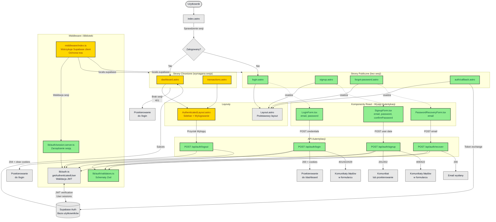

Utworzyłem diagram architektury UI dla systemu autentykacji w pliku .ai/diagrams/ui.md. 

Diagram wizualizuje:

1. Strukturę stron Astro - publiczne (login, signup, forgot-password, callback) i chronione (dashboard, transactions)
2. Komponenty React - formularze autentykacji jako wyspy (LoginForm, SignupForm, PasswordRecoveryForm)
3. API endpoints - /api/auth/* dla logowania, rejestracji, wylogowania i odzyskiwania hasła
4. Middleware i biblioteki - zarządzanie sesjami i walidacja JWT
5. Przepływ danych - od użytkownika przez formularze, API, aż do Supabase Auth

Diagram używa kodowania kolorami:
•  🟢 Zielone - nowe komponenty
•  🟡 Żółte - zaktualizowane komponenty
•  ⚪ Szare - istniejące bez zmian

Dodatkowo dołączyłem szczegółowe opisy kluczowych przepływów (rejestracja, logowanie, reset hasła, wylogowanie, ochrona tras) oraz uwagi implementacyjne dotyczące bezpieczeństwa i zgodności z istniejącą aplikacją.

--------------------------

# Diagram Architektury UI - System Autentykacji

## Opis

Diagram przedstawia zaktualizowaną architekturę interfejsu użytkownika aplikacji BudgetManager po wdrożeniu modułu autentykacji (US-001: Rejestracja, US-002: Logowanie) zgodnie ze specyfikacją techniczną.

### Legenda:
- **Komponenty zaznaczone na zielono** - nowe elementy dodane w ramach implementacji autentykacji
- **Komponenty zaznaczone na żółto** - istniejące elementy zaktualizowane o funkcjonalność autentykacji
- **Komponenty bez koloru** - istniejące elementy bez zmian

<mermaid_diagram>

</mermaid_diagram>

## Kluczowe przepływy

### 1. Rejestracja nowego użytkownika
1. Użytkownik wchodzi na `/signup`
2. Wypełnia formularz `SignupForm` (email, hasło, potwierdzenie hasła)
3. Walidacja po stronie klienta (Zod)
4. POST do `/api/auth/signup`
5. Walidacja po stronie serwera + `supabase.auth.signUp()`
6. Jeśli wymagane potwierdzenie email → komunikat "Sprawdź skrzynkę"
7. Użytkownik klika link w emailu → `/auth/callback` → wymiana tokena → `/dashboard`

### 2. Logowanie użytkownika
1. Użytkownik wchodzi na `/login`
2. Wypełnia formularz `LoginForm` (email, hasło)
3. Walidacja klienta (Zod)
4. POST do `/api/auth/login`
5. `supabase.auth.signInWithPassword()` → ustawienie ciasteczek sesyjnych
6. Sukces (200) → `window.location.assign('/dashboard')`
7. Błąd (401) → komunikat w formularzu

### 3. Odzyskiwanie hasła
1. Użytkownik wchodzi na `/forgot-password`
2. Podaje email w `PasswordRecoveryForm`
3. POST do `/api/auth/recover`
4. Wysyłka emaila z linkiem do `/auth/callback?type=recovery`
5. Użytkownik klika link → formularz ustawienia nowego hasła
6. `supabase.auth.updateUser({ password })`

### 4. Wylogowanie
1. Użytkownik w `AuthenticatedLayout` klika "Wyloguj"
2. POST do `/api/auth/logout`
3. `supabase.auth.signOut()` → wyczyszczenie ciasteczek
4. Przekierowanie do `/login`

### 5. Ochrona tras chronionych
1. Middleware `onRequest` wstrzykuje `locals.supabase` do wszystkich stron
2. Strony chronione (dashboard, transactions) sprawdzają sesję
3. Brak sesji → 401 → istniejąca logika `handle401` przekierowuje do `/login`
4. Sesja prawidłowa → dostęp do strony z `locals.user`

## Uwagi implementacyjne

### Rozdział odpowiedzialności
- **Astro Pages**: SSR, routing, ochrona tras, meta/layout
- **React Components**: Stan formularzy, walidacja klienta, wywołania API
- **API Endpoints**: Walidacja serwera, komunikacja z Supabase Auth
- **Middleware**: Wstrzykiwanie Supabase client, ochrona tras
- **Auth Library**: Funkcje pomocnicze autoryzacji, walidacja JWT

### Bezpieczeństwo
- JWT przechowywane w ciasteczkach `HttpOnly`, `Secure`, `SameSite=Lax`
- Brak przechowywania tokenów w `localStorage`
- Fetch z `credentials: 'include'`
- API akceptuje zarówno nagłówek `Authorization: Bearer <JWT>` (dla zewnętrznych klientów) jak i ciasteczka (dla UI)

### Zgodność z istniejącą aplikacją
- Istniejące endpointy REST (`/api/rest/v1/*`) nie zmieniają kontraktów
- Dodana autoryzacja przez `getAuthenticatedUser()` z `lib/auth.ts`
- Przejście z `SERVICE_ROLE` na walidację JWT + RLS
- Istniejący `handle401` w UI pozostaje bez zmian
